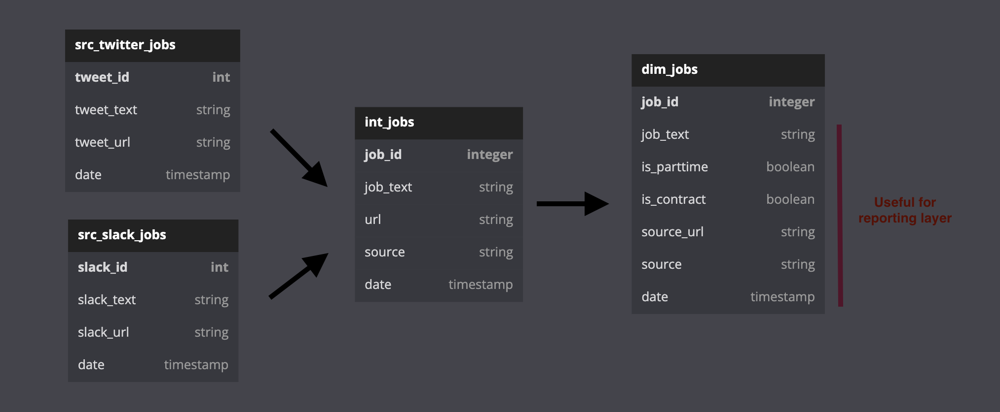

## Under the Radar Jobs

### Objective

The intent of this project is to build an end-to-end data pipeline that serves a list of under-the-radar job announcements from unstructured data sources (tweets and slack channels).

### Workflow

- **Ingestion** 
    - [x] Python script fetches job-related tweets from the twitter API and loads to a JSONL file.
    - [x] Zapier automation fetches data from several Slack #job channels and loads to a Google Sheet
- [x] **Storage** - Python script generates a dataset + tables in BigQuery and loads ingested data there.
- [ ] **Transformation** - dbt transforms source tables, preparing them for a filterable reporting layer.
- [ ] **Reporting** - Looker Studio lists job announcements with filters for parttime and contract positions.
- [ ] **Deployment** - Docker to containerize the pipeline.

### Next Step - Transformation

Here's what I am currently building, as a DAG.

Here's what I plan to build in dbt. 

