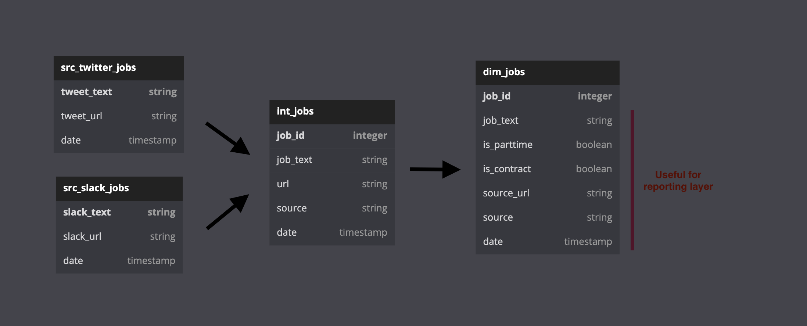

## Under the Radar Jobs

### Objective

The intent of this project is to build an end-to-end data pipeline that serves a list of under-the-radar job announcements from unstructured data sources (tweets and slack channels).

### Workflow

- **Ingestion** 
    - [x] Python script fetches job-related tweets from the twitter API and loads to a JSONL file.
    - [x] Zapier automation fetches data from several Slack #job channels and loads to a Google Sheet
- [x] **Storage** - Python script generates a dataset + tables in BigQuery and loads ingested data there.
- [ ] **Transformation** - dbt transforms source tables, preparing them for a filterable reporting layer.
- [ ] **Reporting** - Looker Studio lists job announcements with filters for parttime and contract positions.
- [ ] **Deployment** - Docker to containerize the pipeline.

### Transformation

Here's what I plan to build in dbt. This is sort of a DAG / ERD mash-up, hopefully that is not too confusing.

### Outstanding Questions

1. Docker is new to me and I won't fully understand it til I get my hands dirty. 
     - a. That said, do you see any obvious barriers to 'dockerizing' this pipeline? In particular the slack > zapier > google sheets side of things
     - b. Is docker's main purpose here to demonstrate that I can hand off my work to another person's machine? 
2. Is use of zapier for slack > sheets ingestion step frowned upon? (I used it for now because it was a quick way to get a second source up and running)
3. Any other major issues you see that you'd encourage me to work on first?