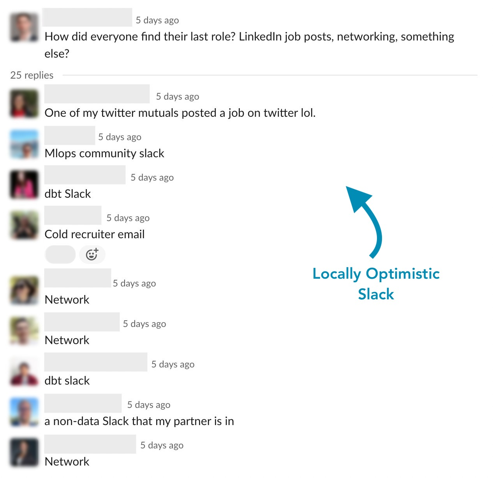
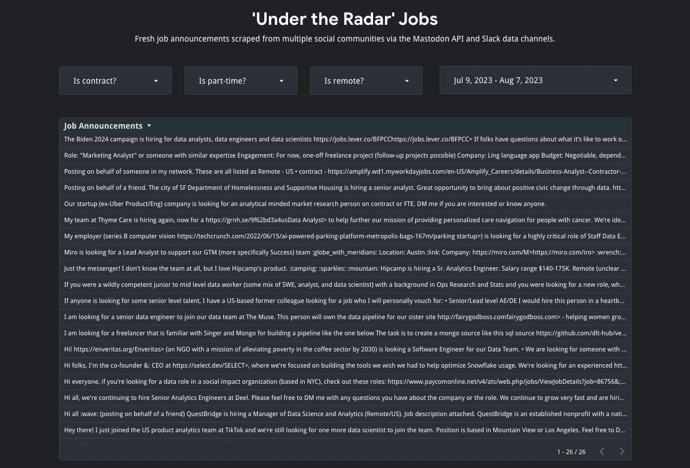

## Under the Radar Jobs

### Objective

My objective is to build a job search tool that taps into online social chatter. 

Specifically, this is a live **end-to-end data pipeline** which takes **unstructured sources** (like Slack and Twitter) as input and generates a customizable list of **'under-the-radar' job announcements** as output.

Why?

 
Finding fulfilling work is a big deal, and I’ve always been interested in the relatively chaotic way that it happens. 

The path to fulfilling work is much faster if you’re plugged into the social communities for your chosen profession. But finding those communities takes time. And once found, the number of communities to monitor can quickly get out of hand.

I wanted to experiment with what it would look like to build a job search tool that uses those communities as input (one that could be repurposed for many different job niches).

 

### Workflow

- [x] **Ingestion** 
    - [x] Python script fetches tweets from the twitter API and loads to a JSONL file.
    - [x] Zapier automation fetches data from several Slack #job channels and loads to a Google Sheet
- [x] **Storage** - Python script generates a dataset + tables in BigQuery and loads ingested data there.
- [x] **Transformation** - dbt transforms source tables, preparing them for a filterable reporting layer.
- [x] **Reporting** - Looker Studio lists job announcements with filters for part-time, contract and remote positions.
- [ ] **Deployment** - Docker to containerize the pipeline.

### Transformation

**Current state of the DAG**

Key transformations performed in [stg_jobs model](https://github.com/diaghilev/under-the-radar/blob/main/dbt/models/stg/stg_jobs.sql):
- [x] Slack data consists of _threaded messages_. Our desired output excludes thread replies.
- [x] Tweet data includes _duplicate tweets_. Our desired output removes duplicates.
- [x] Data from _multiple sources_ must be merged and presented in a single list.

Key transformations performed in [dim_jobs model](https://github.com/diaghilev/under-the-radar/blob/main/dbt/models/mart/dim_jobs.sql):
- [x] Identify which jobs are potentially part-time, contract or remote from unstructured text.
- [ ] Present unstructured, messy text in a more human-readable format.

Tests
- [x] Unique and Not Null tests for all primary keys
- [ ] Additional tests coming soon

### Reporting

My primary goal is to generate a live list of 'under the radar' job announcements [here](https://lookerstudio.google.com/u/0/reporting/8c81c373-e150-47ec-8479-932fb48ebaf8/page/tEnnC/edit) (first pass).

But I also had a few questions, which will be answered over time in the [wkly_metrics](https://github.com/diaghilev/under-the-radar/blob/main/dbt/models/mart/wkly_metrics.sql) table:
- [x] In our sample, do we see an RTO trend in the form of decreasing remote jobs over time?
- [x] In our sample, is there an increase in contract jobs (relative to all jobs) during this economic downturn?
- [x] In our sample, is there an increase in parttime jobs (relative to all jobs) during this economic downturn?

